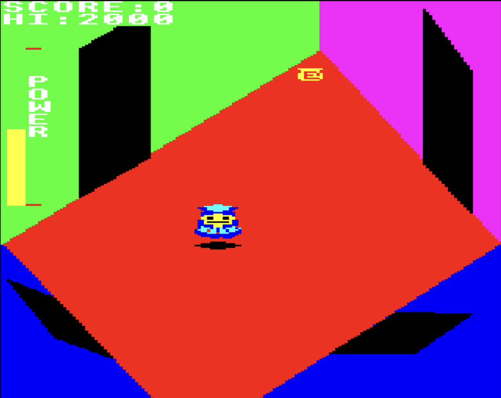

# beeb-typeins
Old BBC Micro programs typed in from magazines in the 1980's

## Contents

Game (jsbeeb link) | Source Folder | Publication | Date | Page | Screenshot
-|-|-|-|-|-
[Robo-1](https://bbc.godbolt.org/?loadBasic=https%3A%2F%2Fraw.githubusercontent.com%2Fdr-grim%2Fbeeb-typeins%2Fmain%2FRobo-1%2FRobo-1.txt&embed&autorun&model=Master) | [Robo-1/](Robo-1/) | [Computer & Video Games](https://archive.org/details/Computer_Video_Games_Issue_037_1984-11_EMAP_Publishing_GB) | November 1984 | 182 | 

## Thanks to

* [jsbeeb](https://github.com/mattgodbolt/jsbeeb) - without this, it wouldn't be nearly as simple!